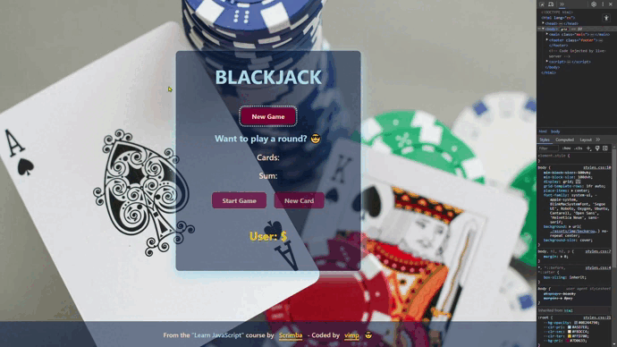
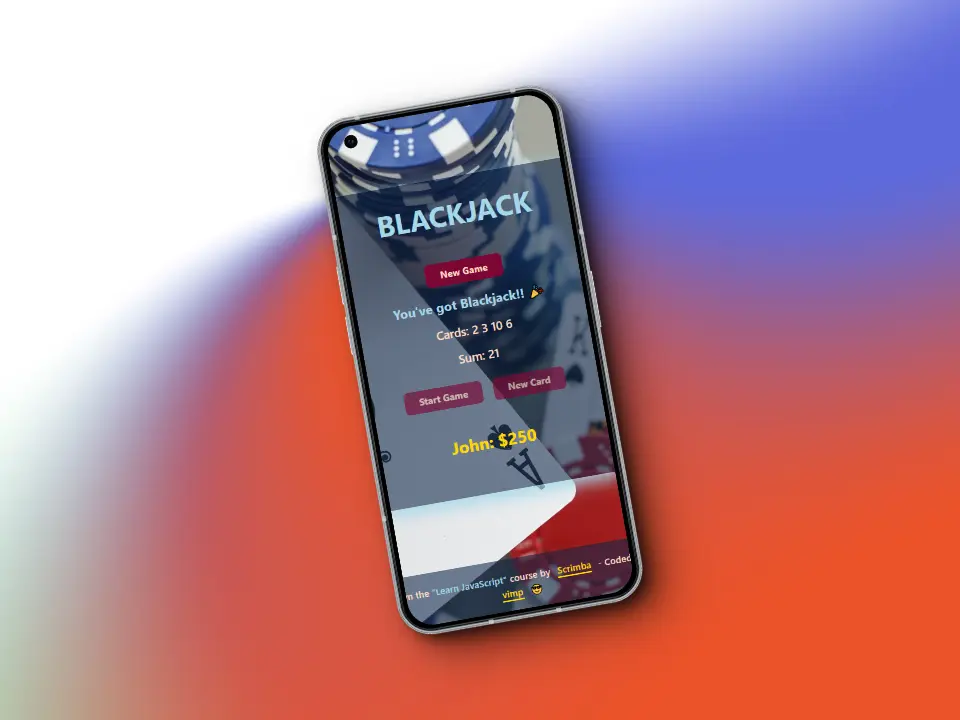
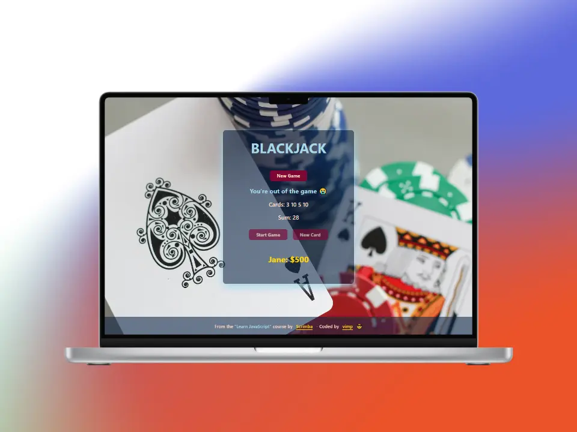

# Blackjack Game

This is a solution for the project **"Blackjack Game"** from the ["Learn JavaScript"](https://scrimba.com/learn/learnjavascript) course by [Scrimba](https://scrimba.com/)

## 📱 Mobile

## 💻 Desktop

## Demo

✨ Want to have a look? [click here](https://mendez-v.github.io/blackjack-game/) 👀

## Resources

🃏 [IconScout](https://iconscout.com/) - Free Card Icon in Glyph Style
By [Mohit Gandhi](https://iconscout.com/contributors/mcgandhi61)

🖼 Image by [6171862](https://pixabay.com/users/6171862-6171862/?utm_source=link-attribution&utm_medium=referral&utm_campaign=image&utm_content=5619014) from [Pixabay](https://pixabay.com//?utm_source=link-attribution&utm_medium=referral&utm_campaign=image&utm_content=5619014)